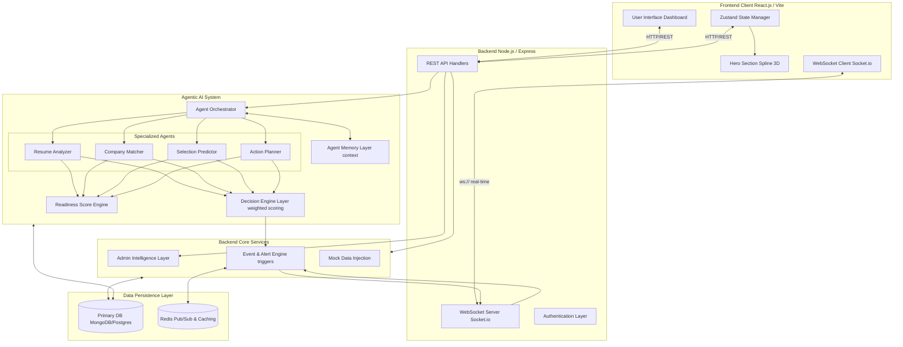

# PlaceIQ System Architecture

## 1. High-Level System Architecture Diagram

## 2. End-to-End Data Flow Overview

**The PlaceIQ flow relies on deterministic logic empowered by AI explanation, rather than black-box models.**

1. **User Action (Input)**: A student uploads their resume or updates their profile via the React Frontend.
2. **API Ingestion**: The Express API layer authenticates and parses the request. If this is a new session, Mock Data injected during initial launch ensures the dashboards look populated.
3. **Agent Delegation**: 
   - The Orchestrator picks up the event.
   - The *Resume Analyzer* agent triggers text NLP or heuristics to structure the resume.
   - The *Readiness Score Engine* updates the student's base score (0-100) based on CGPA, mock interviews, and resume quality.
4. **Decision Engine & Prediction**: 
   - The *Company Matcher* cross-references the student's skills with active company pipelines.
   - The *Selection Predictor* weighs the Match Score (50%), Predictor logic (30%), and Deadline (20%) to create the final deterministic ranking.
5. **Real-time Alerting**: If the score results in an immediate insight (e.g. deadline < 3 days), the *Event & Alert Engine* publishes an event through Redis Pub/Sub, pushed directly to the React frontend via WebSocket.
6. **Persistence & Memory**: All generated advice and applied decisions are stored in the *Agent Memory Layer* in the DB, preventing duplicate or circular feedback on future interactions.

## 3. Component Interactions Summary

- **Frontend ↔ Backend**: primarily REST for CRUD and data-fetching. WebSockets strictly for instant nudges, alerts, and real-time dashboard stat updates.
- **Backend ↔ Agents**: Modular function calls. The backend invokes the Orchestrator, passing user IDs. The Orchestrator routes data synchronously or via background queues (if scaling).
- **Agents ↔ Database**: Agents aggressively read/write from the Memory Layer to provide stateful context, avoiding redundant calculations. 
- **Backend ↔ Database**: The persistent data store handles profiles, past memory, structured resume data, and preloaded mock datasets.

## 4. Scalability & Design Philosophy

> *"AI is used for reasoning and explanation, while core decisions are driven by deterministic logic."*

- **Stateless Backend**: Every Node.js request handles state via the DB or Redis. 
- **Microservice Ready**: The Agent Modules are currently monolithic helper scripts but encapsulate all domain logic, allowing smooth extraction into separate Python/Node microservices later.
- **WebSocket Scaling**: Employs Redis Pub/Sub to sync WebSockets, ensuring alerts fire correctly across multiple server instances.
